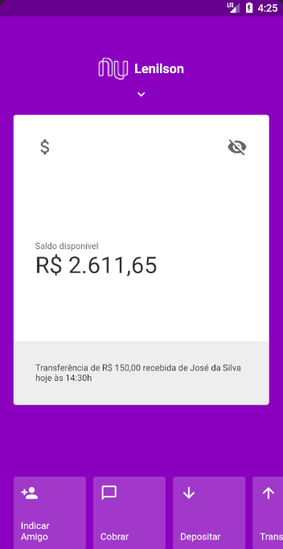

# Nubank UI Flutter Clone (sort of)

This project is meant to explore Flutter features by making a simple version of Nubank's app interface.

Inspired by the Nubank app interface clone build in React Native: [youtube-react-native-nubank](https://github.com/Rocketseat/youtube-react-native-nubank), this app seek to explore similar features present on React Native like styling, animation and gesture handling (Flutter has done very well so far).

**Screencapture**

    

